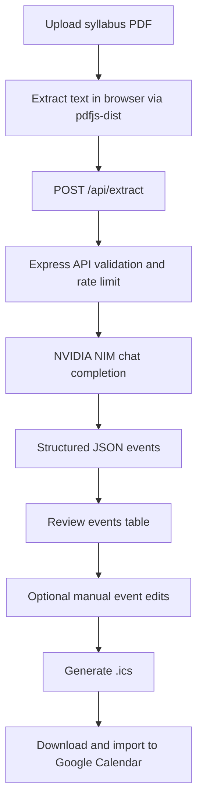
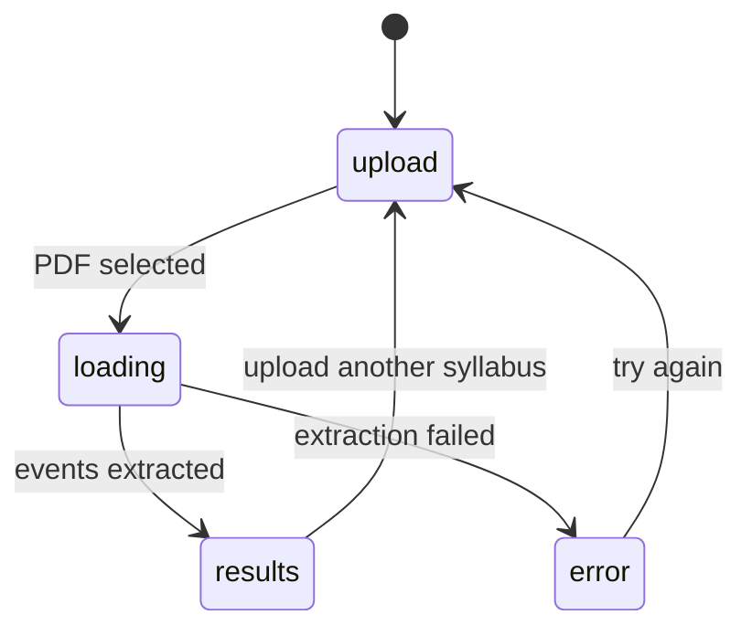

# SyllabusCal 📅

Turn a class syllabus PDF into a clean `.ics` calendar file you can import into Google Calendar.

Live site: https://syllabuscal.ranjansharma.info.np

## Why I built this

I wanted a faster way to move deadlines from long syllabus documents into a calendar without manually typing every date.  
SyllabusCal extracts text in the browser, sends only the syllabus content to a protected backend endpoint, returns structured events, and lets you export an `.ics` file in one flow.

## What it does

- Upload a syllabus PDF
- Extract text client side with `pdfjs-dist`
- Parse assignments, exams, labs, readings, and other dated items using NVIDIA NIM (`meta/llama-4-maverick-17b-128e-instruct`)
- Review and edit extracted events in a table UI
- Add missing events manually
- Export selected events as an `.ics` calendar file

## Product flow



## Architecture diagram

```mermaid
flowchart LR
    subgraph Browser[Frontend React + Vite]
      U[FileUpload component]
      P[pdfExtractor service]
      T[EventsTable component]
      I[icsGenerator service]
    end

    subgraph API[Backend Node + Express]
      R[/api/extract]
      S[Input checks + DLP regex]
      L[Rate limiter + helmet + cors]
      N[NVIDIA NIM API]
    end

    U --> P
    P --> R
    R --> S
    S --> L
    L --> N
    N --> T
    T --> I
```

## UI state flow



## Main stack

- Frontend: React 19, Vite 8, vanilla CSS
- Backend: Node.js, Express 5
- PDF parsing: `pdfjs-dist`
- AI extraction: NVIDIA NIM API
- Export format: RFC 5545 `.ics`

## Local setup

1. Clone and enter the repo
   ```bash
   git clone https://github.com/Konseptt/syllabus-cal.git
   cd syllabus-cal
   ```

2. Install dependencies
   ```bash
   npm install
   ```

3. Add environment variables in `.env`
   ```env
   NVIDIA_API_KEY=your_nvidia_api_key_here
   PORT=3001
   ```

4. Run in development
   ```bash
   npm run dev
   ```

5. Open
   - Frontend: `http://localhost:5173`
   - API health: `http://localhost:3001/api/health`

## Scripts

- `npm run dev` starts frontend and backend together
- `npm run dev:frontend` starts Vite only
- `npm run dev:backend` starts Express only
- `npm run lint` runs ESLint
- `npm run build` creates a production build

## Security and privacy notes

- API key stays on the backend
- Requests are rate limited
- `helmet` and `cors` middleware are enabled
- Input is checked for obvious SSN and card number patterns before model calls
- Text is processed in memory and not written to disk by app logic

## Contributing

Pull requests are welcome. If you want to improve extraction quality, UI clarity, or export behavior, feel free to open an issue or submit a PR.
